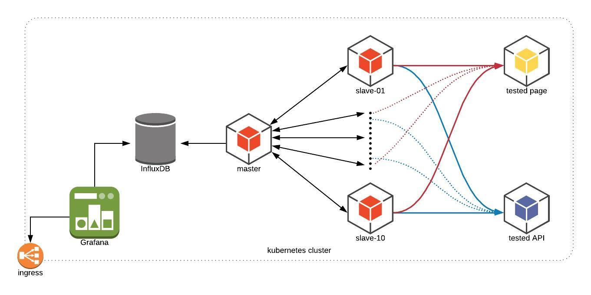

# STRESSTESTMULTINODE

Jmeter distributed load testing with k8s environment.

## Usage



1. setup jmeter cluster and influxdb at `deploy` branch
2. invoke load test at `invoke` branch

### Setup jmeter

Run the pipeline at `deploy` branch.

default influxdb user:

```
Username: admin123
Password: admin123
```

### Invoke test

Run the pipeline at `invoke` branch.
