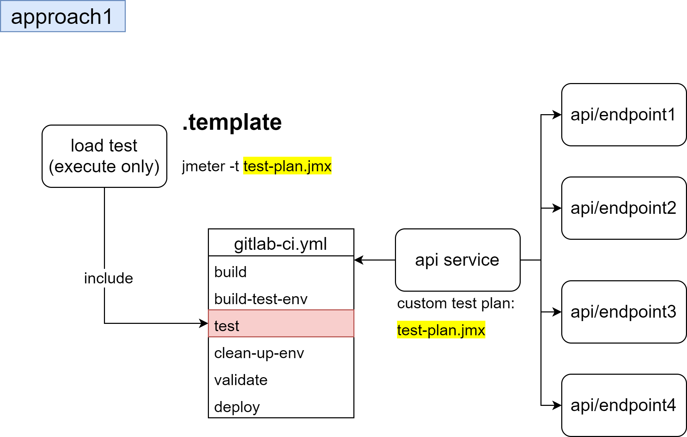

# jmeter-load-test

This is a `load test as a service` demo project based on Apache Jmeter. 

## Usage

This project can included in other projects' CI pipeline for load testing purpose before deploying.
Basic workflow may seemed like below.



Four stages could be added if `templates/jmeter-template.yml` is included in the service project. They are `set-up-test-env`, `load-test`, `tear-down-test-env` and `validate` respectively. For each stage:

1.  `set-up-test-env`: Set up a test environment for load testing. In this demo project, `$KUBE_CONFIG`, `$VALUE_FILE` and `$HELM_FOLDER` variables must be provided. 

2. `load-test`: The tested service shoud provide a json file named `load-test.json` for load test parameters, e.g., how many loops and threads are going to be delivered.  This stage will validate the json format using json schema file `test-plan.schema.json`, then parse it into a jmx file via the template `test-plan-template.jmx` for real load testing.

example json format:

```json
{
    "LOOP_COUNT": "3",
    "THREADS": "200",
    "RAMP_UP_PERIOD": "50",
    "TARGETS": [
      {"TARGET_HOST": "httpbin.org", "TARGET_PORT": "443", "TARGET_PROTOCOL": "https", "TARGET_PATH": "/get"},
      {"TARGET_HOST": "httpbin.org", "TARGET_PORT": "443", "TARGET_PROTOCOL": "https", "TARGET_PATH": "/get/1"},
      {"TARGET_HOST": "httpbin.org", "TARGET_PORT": "443", "TARGET_PROTOCOL": "https", "TARGET_PATH": "/get/2"}
    ]
}
```

3. `tear-down-test-env`: Tear down the test env whether load test success or not.

4. `validate`: Validate the indicators of load test result. Currently support maximum response time.